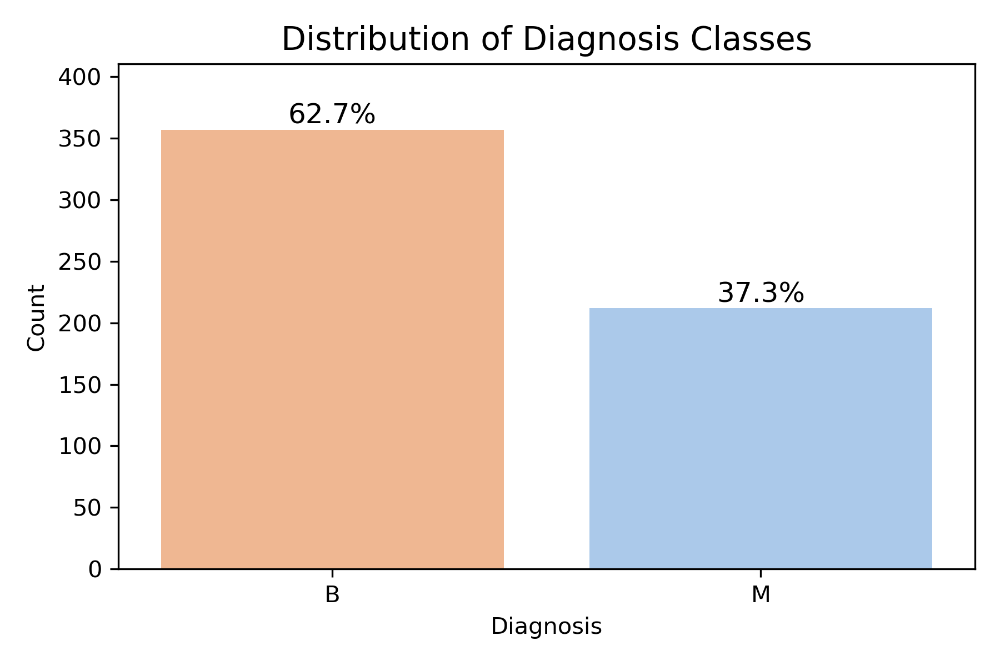
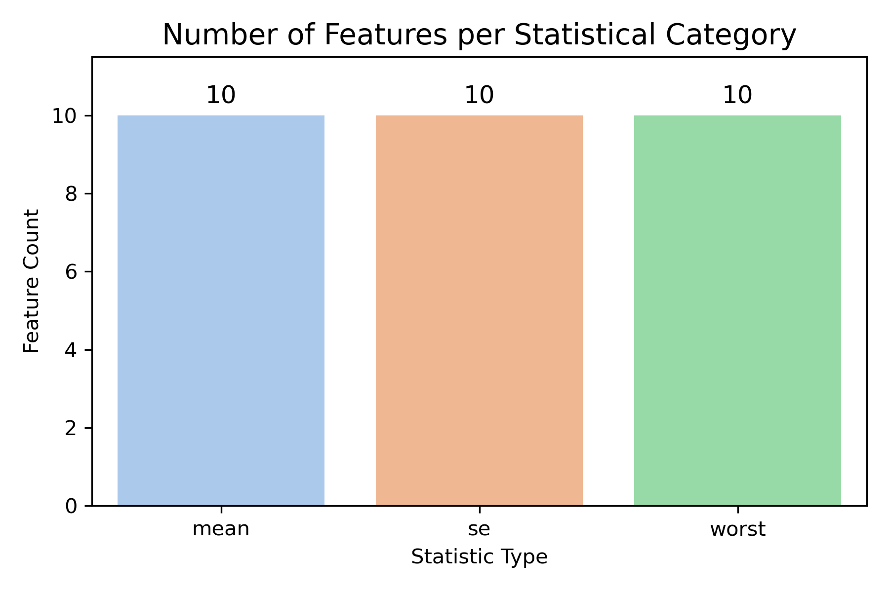
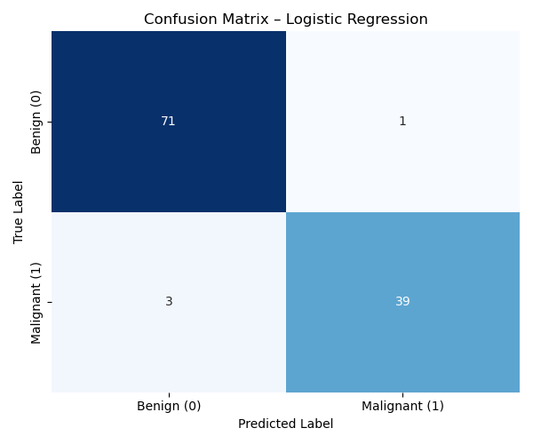
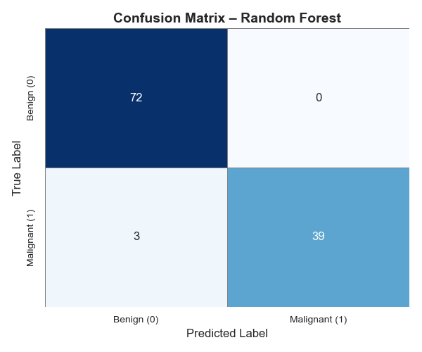
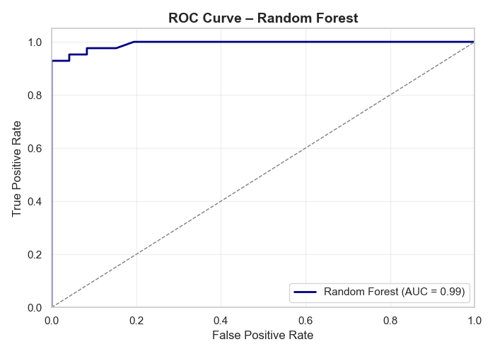
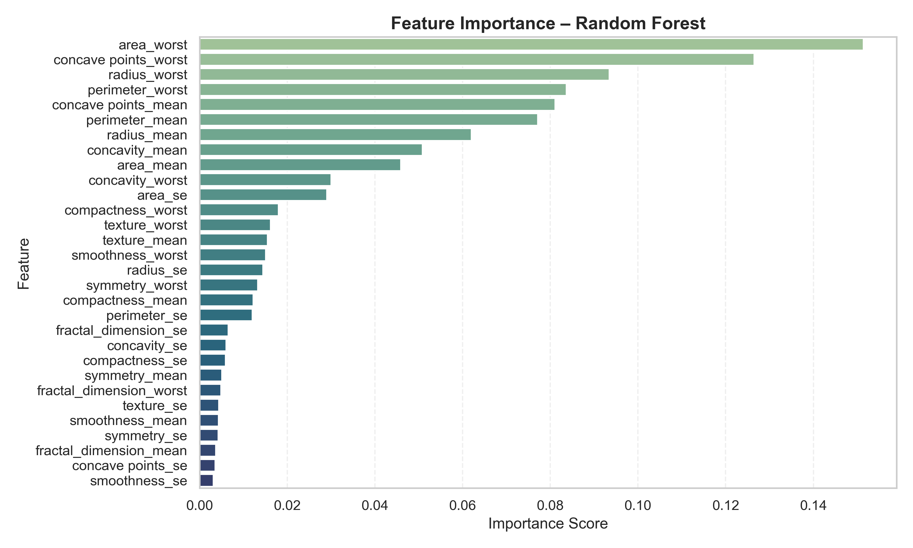
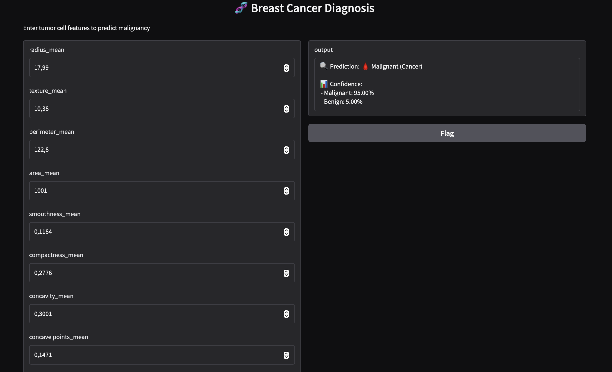
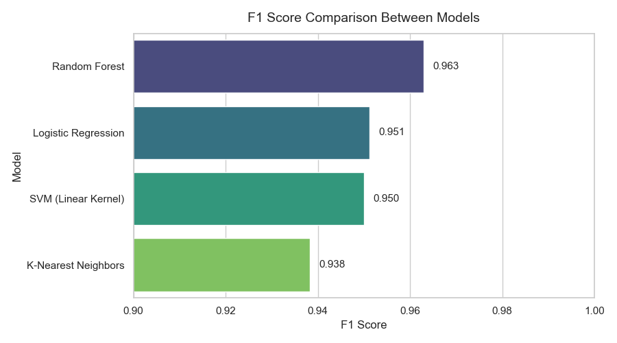

🧬 Breast Cancer Classification with Machine Learning  
> End-to-end pipeline to predict tumor malignancy from cell morphology features

This project builds a machine learning pipeline to predict whether a breast tumor is **malignant (M)** or **benign (B)** using features extracted from digitized images of breast cell nuclei. The dataset used is the *Breast Cancer Wisconsin (Diagnostic)* dataset, a standard benchmark in medical ML tasks.


## 🧪 Environment

- Python 3.10
- scikit-learn 1.3
- pandas 2.0
- seaborn 0.12
- matplotlib 3.7
---

## 🧬 Clinical Background

This dataset was created from digitized images of fine needle aspirates (FNA) of breast masses. Each observation represents a tumor, described by 30 features of cell nuclei such as radius, texture, and symmetry. Machine learning models like the one developed here can support radiologists by providing fast, accurate second opinions.
> For example, computer-aided diagnosis (CAD) tools have been shown to improve the sensitivity of breast cancer detection in mammography by 7.2% according to a large-scale retrospective study [(Lehman et al., 2015)](https://pubmed.ncbi.nlm.nih.gov/25758600/).


---

## 🧭 Table of Contents
1. [Problem Statement](#-problem-statement)
2. [Dataset](#-dataset)
3. [Project Structure](#-project-structure)
4. [Exploratory Data Analysis](#-exploratory-data-analysis-highlights)
5. [Data Preprocessing](#-data-preprocessing)
6. [Model Training & Evaluation](#-model-training--evaluation)
7. [Visual Evaluation](#-visual-evaluation)
8. [Cross-Validation](#-cross-validation)
9. [Final Model Selection](#-final-model-selection)
10. [Next Steps](#-next-steps)
11. [Reproducibility](#-reproducibility)
12. [Author](#-author)
13. [License](#-license)
---

## 📌 Problem Statement

Breast cancer is one of the most prevalent cancers worldwide, and early detection is critical to improving patient outcomes. This project aims to assist diagnosis by developing an automated model that classifies tumors based on quantitative cell features.
A key challenge is distinguishing malignant tumors from benign ones using subtle morphological patterns.

---

## 📂 Dataset

- **Source**: [Kaggle / UCI ML Repository](https://www.kaggle.com/datasets/uciml/breast-cancer-wisconsin-data)
- **Observations**: 569 patient records
- **Features**: 30 numerical predictors related to cell nucleus morphology (mean, standard error, and worst-case)
- **Target**: Diagnosis (`M` = malignant, `B` = benign)

---

## 📁 Project Structure

```
.
├── data/
│   ├── raw/
│   │   └── data.csv                     # Original dataset from Kaggle
│   └── processed/
│       ├── X_train.csv                 # Training features
│       ├── X_test.csv                  # Test features
│       ├── y_train.csv                 # Training labels
│       └── y_test.csv                  # Test labels
│
├── notebooks/
│   ├── 01_eda.ipynb                    # Exploratory Data Analysis + medical context
│   ├── 02_preprocessing.ipynb         # Preprocessing: cleaning, encoding, scaling, splitting
│   └── 03_modeling.ipynb              # Model training, evaluation, comparison & cross-validation
│
├── outputs/
│   └── figures/
│       ├── diagnosis_distribution.png         # Class imbalance visualization
│       ├── feature_stats_distribution.png     # Statistical summary of features
│       ├── confusion_matrix_logistic.png      # Confusion matrix for logistic regression
│       ├── roc_curve_rf.png                   # ROC curve for Random Forest
│       ├── feature_importance_rf.png          # Feature importance from Random Forest
│       └── model_comparison_f1.png            # Model performance comparison
│
├── metrics/
│   └── model_comparison_results.csv    # Raw scores for all models
│
├── model/
│ ├── rf_model.joblib # Trained Random Forest model
│ └── scaler.joblib # Scaler used during preprocessing
│
├── app.py                              # Gradio interface for inference
├── LICENSE                             # MIT License
├── requirements.txt                    # Dependencies for reproducibility
└── README.md                           # Project overview and documentation

```

---

## 🔍 Exploratory Data Analysis (see [01_eda.ipynb](notebooks/01_eda.ipynb))

- Tumor diagnosis is **imbalanced**: ~62% benign, ~38% malignant.
- Strong correlation found between `radius_mean`, `perimeter_mean`, and `area_mean`.
- Features were grouped into 3 types: mean, standard error (SE), and worst-case.






---

## 🔧 Data Preprocessing

- Dropped irrelevant columns (`id`, `Unnamed: 32`)
- Encoded target variable into binary (`1`=Malignant, `0`=Benign)
- Applied **StandardScaler** to normalize features (mean = 0, std = 1)
- Split dataset using **80/20** train-test ratio with stratified sampling

---

## 🤖 Model Training & Evaluation

The baseline model used is **Logistic Regression**, evaluated on accuracy, precision, recall, and F1-score. Later, other models were compared:

| Model                 | Accuracy | Precision | Recall | F1-score |
|----------------------|----------|-----------|--------|----------|
| **Random Forest**     | **0.9737**  | 1.0000    | 0.9286 | **0.9630** |
| Logistic Regression  | 0.9649   | 0.9750    | 0.9286 | 0.9512 |
| SVM (Linear Kernel)  | 0.9649   | 1.0000    | 0.9048 | 0.9500 |
| K-Nearest Neighbors  | 0.9561   | 0.9744    | 0.9048 | 0.9383 |

✅ The **Random Forest** classifier achieved the best performance across all metrics.

---

## 📊 Visual Evaluation

### Confusion Matrices

- 🔹 **Logistic Regression** (baseline model)



- 🔸 **Random Forest** (final selected model)



Note: Logistic Regression is used as a baseline. Random Forest is the selected model due to higher recall and robustness.A

### ROC Curve



- The confusion matrix shows only 4 misclassifications out of 114.
- ROC AUC score for Random Forest: **0.99**

---
### 🔍 Feature Importance

Understanding which features contribute most to the model's predictions enhances explainability and transparency — especially important in healthcare.



🧠 The most influential features identified by the **Random Forest** classifier include:

- `area_worst`: total size of the worst-case tumor region
- `concave points_worst`: severity of concave regions (sharp indentations)
- `radius_worst` and `perimeter_worst`: indicators of tumor growth
- `concave points_mean`: average sharpness of irregularities

> These results align well with clinical knowledge: larger, irregularly shaped masses are more likely to be malignant.

---

### 🚀 Live App Preview

You can try the deployed diagnostic tool below. This interactive interface allows clinicians or researchers to input tumor features and receive instant classification feedback:



🔗 [Try it live on Hugging Face Spaces](https://huggingface.co/spaces/EmilioAI/breast-cancer-diagnosis)

---

## 🔁 Cross-Validation

5-fold cross-validation was applied to the final model to validate its generalizability (Using `StratifiedKFold` with `random_state=42`):

```
F1 Scores across folds: [1.00, 0.99, 0.91, 0.97, 0.89]
Average F1 Score: 0.95
```

---

## 🏆 Final Model Selection

The **Random Forest** classifier was selected as the final model due to its:

✔️ Superior recall (sensitivity) for malignant cases  
✔️ Balanced precision and F1-score  
✔️ Robustness under cross-validation  
✔️ ROC AUC score of 0.99 (excellent)

🧠 Random Forest is particularly well-suited for medical applications because of its ability to handle feature interactions, reduce overfitting, and provide interpretable outputs via feature importance.

📊 Summary of model performance (see full results [here](metrics/model_comparison_results.csv))  


---

## 🚀 Next Steps

- 🔍 Hyperparameter tuning (GridSearchCV)
- 🧠 SHAP or LIME explainability analysis
- 🚀 Deploy as interactive app (e.g., Streamlit or Gradio)
- 🏥 Integrate into a clinical decision support system (CDSS) prototype
- 💡 Deployment will be tackled in **Week 6** of my AI roadmap (Streamlit/Gradio).

---
## 🚀 Deployment

You can run the prediction app locally with [Gradio](https://gradio.app/):

---

## 💻 Reproducibility

To reproduce this project:

```bash
git clone https://github.com/Emiliomr-AI/breast-cancer-ml
cd breast-cancer-ml
pip install -r requirements.txt
```
📂 Start by opening `notebooks/01_eda.ipynb` and follow the pipeline step by step.

---
## 👤 Author

**Emilio Molina Román**  
Driven by curiosity and committed to building real-world AI solutions.
📍 Spain | 🌐 Open to remote roles  
🔗 [LinkedIn](https://www.linkedin.com/in/emilio-ai/) | [GitHub](https://github.com/Emiliomr-AI)

---

## 📜 License

This project is licensed under the MIT License. See the [LICENSE](LICENSE) file for details.